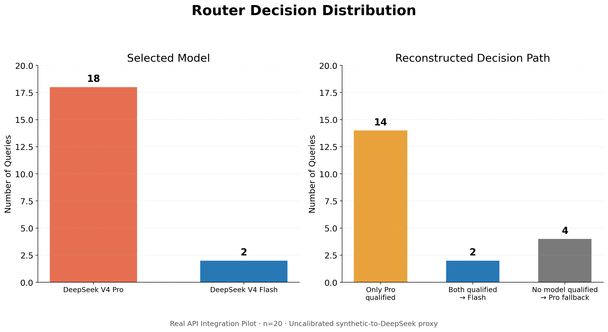

# Real API Pilot：Synthetic-to-Real Calibration Gap 分析

> 本报告只读取既有 `records.jsonl` 与 `results.json`，并进行离线统计；没有调用任何 API，也没有重新运行或修改 Router。

## 数据口径

- 原始记录：60 条，包含 20 条 Router 记录。
- 原始均值只统计成功请求；失败请求的成本、时延和 Token 为缺失值。
- `records.jsonl` 没有保存 `decision_reason` 或候选概率。下文的决策路径根据 `selected_model`、`fallback_used`、冻结的 0.8 概率门槛、Flash 成本低于 Pro，以及当前 Router 规则重建。
- 重建没有产生新的模型结果；它只用于解释已经保存的选择。

## 1. Router 决策分布

- Query 数量：**20**
- DeepSeek V4 Pro：**18** 次
- DeepSeek V4 Flash：**2** 次
- 仅 Pro 达到预测门槛：**14** 条
- 两个模型均达到预测门槛，按成本选择 Flash：**2** 条
- 两个模型均未达到预测门槛，fallback 选择 Pro：**4** 条

Router 的成本优先级只在候选模型通过质量概率门槛后生效。本次 Pilot 中，Flash 仅有两次进入合格集合，因此成本阶段几乎没有选择空间。

## 2. Query 级校准缺口

| Query ID | Selected Model | Reconstructed Prediction Reason | Actual Outcome | Analysis |
|---|---|---|---|---|
| real-query-001 | Pro | `QUALIFIED_ONLY_MODEL` | 调用成功；Judge=1.00（通过） | 仅 Pro 达标；Flash 未进入成本比较集合。 |
| real-query-002 | Pro | `QUALIFIED_ONLY_MODEL` | 调用成功；Judge=1.00（通过） | 仅 Pro 达标；Flash 未进入成本比较集合。 |
| real-query-003 | Pro | `QUALIFIED_ONLY_MODEL` | 调用成功；Judge=1.00（通过） | 仅 Pro 达标；Flash 未进入成本比较集合。 |
| real-query-004 | Pro | `QUALIFIED_ONLY_MODEL` | 失败：timeout | 仅 Pro 达标；Flash 未进入成本比较集合。 |
| real-query-005 | Pro | `QUALIFIED_ONLY_MODEL` | 调用成功；Judge=1.00（通过） | 仅 Pro 达标；Flash 未进入成本比较集合。 |
| real-query-006 | Flash | `QUALIFIED_MINIMUM_COST` | 调用成功；Judge=1.00（通过） | Flash 与 Pro 均达标；质量门槛后按最低估计成本选择 Flash。 |
| real-query-007 | Pro | `QUALIFIED_ONLY_MODEL` | 调用成功；Judge=1.00（通过） | 仅 Pro 达标；Flash 未进入成本比较集合。 |
| real-query-008 | Pro | `QUALIFIED_ONLY_MODEL` | 调用成功；Judge=1.00（通过） | 仅 Pro 达标；Flash 未进入成本比较集合。 |
| real-query-009 | Pro | `QUALIFIED_ONLY_MODEL` | 调用成功；Judge=1.00（通过） | 仅 Pro 达标；Flash 未进入成本比较集合。 |
| real-query-010 | Pro | `QUALIFIED_ONLY_MODEL` | 调用成功；Judge=1.00（通过） | 仅 Pro 达标；Flash 未进入成本比较集合。 |
| real-query-011 | Pro | `FALLBACK_MAX_PASS_PROBABILITY` | 失败：timeout | 两个候选均未达到 0.8；fallback 选择预测通过概率更高的 Pro。 |
| real-query-012 | Pro | `QUALIFIED_ONLY_MODEL` | 失败：timeout | 仅 Pro 达标；Flash 未进入成本比较集合。 |
| real-query-013 | Pro | `QUALIFIED_ONLY_MODEL` | 调用成功；Judge=1.00（通过） | 仅 Pro 达标；Flash 未进入成本比较集合。 |
| real-query-014 | Pro | `QUALIFIED_ONLY_MODEL` | 调用成功；Judge=1.00（通过） | 仅 Pro 达标；Flash 未进入成本比较集合。 |
| real-query-015 | Pro | `FALLBACK_MAX_PASS_PROBABILITY` | 调用成功；Judge=1.00（通过） | 两个候选均未达到 0.8；fallback 选择预测通过概率更高的 Pro。 |
| real-query-016 | Flash | `QUALIFIED_MINIMUM_COST` | 调用成功；Judge=1.00（通过） | Flash 与 Pro 均达标；质量门槛后按最低估计成本选择 Flash。 |
| real-query-017 | Pro | `QUALIFIED_ONLY_MODEL` | 调用成功；Judge=1.00（通过） | 仅 Pro 达标；Flash 未进入成本比较集合。 |
| real-query-018 | Pro | `FALLBACK_MAX_PASS_PROBABILITY` | 调用成功；Judge=1.00（通过） | 两个候选均未达到 0.8；fallback 选择预测通过概率更高的 Pro。 |
| real-query-019 | Pro | `FALLBACK_MAX_PASS_PROBABILITY` | 调用成功；Judge=1.00（通过） | 两个候选均未达到 0.8；fallback 选择预测通过概率更高的 Pro。 |
| real-query-020 | Pro | `QUALIFIED_ONLY_MODEL` | 调用成功；Judge=1.00（通过） | 仅 Pro 达标；Flash 未进入成本比较集合。 |

### 观察

- 14条 Query 的代理预测只允许 Pro 进入合格集合，Router 无法在这些 Query 上利用 Flash 的成本优势。
- 2条 Query 中两个模型都达标，Router 按既定规则选择了 Flash，说明质量门槛后的成本优先逻辑正常执行。
- 4条 Query 进入 fallback；这时策略优先选择预测通过概率最高的模型，因此仍然选择 Pro。
- Flash baseline 的17条成功记录全部被现有 Judge 判为通过且评分为1.0，而代理 Predictor 只让 Flash 在2条 Router Query 中达到门槛。这是明显的校准不一致信号；同时，Judge 的满分集中也意味着当前质量评价区分度有限。

## 3. Router 与 Strongest 的共同成功 Query 对比

共同成功 Query：**16** 条（real-query-001, real-query-002, real-query-003, real-query-006, real-query-007, real-query-008, real-query-009, real-query-010, real-query-013, real-query-014, real-query-015, real-query-016, real-query-017, real-query-018, real-query-019, real-query-020）。

| Metric | Router | Strongest | Router − Strongest | Relative Difference |
|---|---:|---:|---:|---:|
| Average Cost (USD) | 0.001476232 | 0.001062324 | +0.000413907 | +39.0% |
| Average Latency (ms) | 33806.08 | 23593.36 | +10212.72 | +43.3% |
| Average Output Tokens | 1652.19 | 1165.69 | +486.50 | +41.7% |

配对后仍可见 Router 的成本和时延更高。其平均输入规模与 Strongest 基本相同，但 Router 的平均输出 Token 更多。真实 API 的两次调用是独立生成，输出长度、服务时延和超时状态会波动，因此该差异不能单独归因于 Router 算法。

原始非配对平均值还受到失败集合差异影响：Router 成功17条、失败3条；Strongest 成功18条、失败2条。例如 `real-query-005` 在 Router 中成功并生成9,142个输出 Token，而 Strongest 对应调用超时，该长响应进入 Router 均值但没有进入 Strongest 均值。共同成功口径减少了这部分偏差。

## 4. PPT 可用总结

- 当前 Real API Pilot 验证了 `Query → Predictor → Router → DeepSeek API → Judge → Metrics` 的真实调用闭环。
- Router 在20条 Query 中选择 Pro 18次，主要因为 synthetic 代理 Predictor 只让 Flash 在2条 Query 中达到质量概率门槛。
- Predictor 使用 `dev-model-a → deepseek-v4-pro`、`dev-model-e → deepseek-v4-flash` 的人工代理映射，尚未使用真实 DeepSeek 历史数据校准。
- 真实模型表现存在分布偏移，同时受到输出长度、服务时延、超时和 Judge 区分度的影响。
- 本次结果用于说明工程闭环和校准缺口，不用于声明 Router 获得性能提升、降低成本或优于 baseline。

## 结论边界

当前结果支持“真实调用链已经打通”和“synthetic-to-real 校准是下一阶段必要工作”。它不支持真实环境中的算法优越性结论。后续需要使用真实 DeepSeek 历史记录完成模型级概率校准，并在新的冻结测试集上评估。
